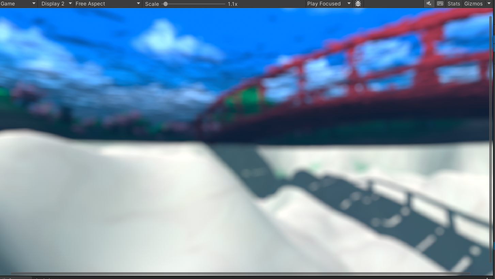
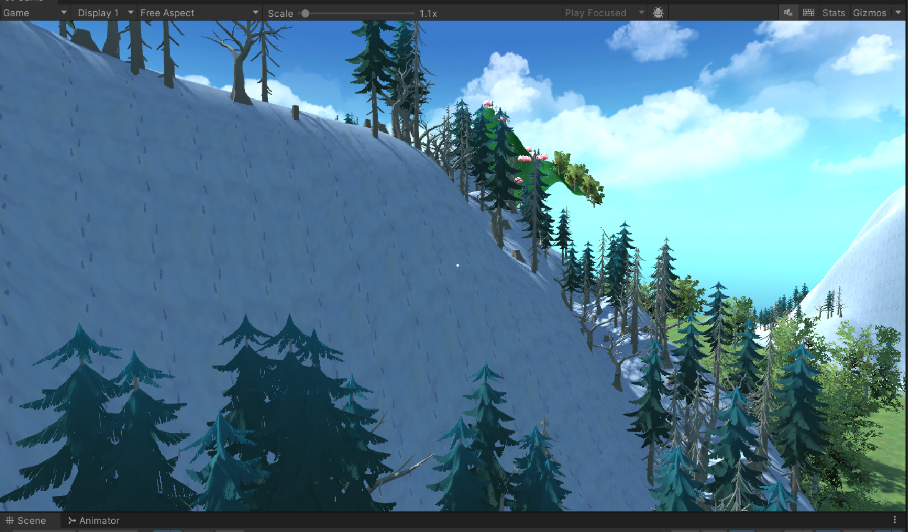

# Lab 3:
Main Launch area is the city and the level will be create it at the island.

Video: 

https://github.com/user-attachments/assets/867d7281-e223-4535-b83e-c5f9c0289553

# Lab 4:
##    - Level 1:

##    - Launch/Island

### Video: 

Something that happens is that if the FlyCamera and the Tour is active at the same time the camera do not do the rotation because is following the mouse while is doing the trasitions but it does continue moving. For purposes of the video I had the flythrought unactive at the beginning and then turned it on.

https://github.com/user-attachments/assets/0b7c37a0-ffb9-45b3-84e7-b7453482c788

## Credits:

Video: https://www.youtube.com/watch?v=Vsj_UpnLFF8

Character: https://www.mixamo.com/

UnderWater effect: https://www.bing.com/videos/riverview/relatedvideo?q=underwater+blurry+vision+unity&mid=754784C78CEA247FFDD8754784C78CEA247FFDD8&FORM=VIRE

# Assigment 5 Camera + Character

  ## Player Controls Script

https://github.com/user-attachments/assets/4155051c-ab65-485f-82a9-65040851c1f9

  ### Rigid Camera

https://github.com/user-attachments/assets/ef7c54d6-eb93-41b1-a5db-93761b427311

  ### Sprint Camera

https://github.com/user-attachments/assets/d90cf857-f8ec-4c01-ae99-ebc2e3752273

# Assigment 6 Bezier Faster Stronger
## Path Following
### Follow Path Linear
https://github.com/user-attachments/assets/0592f612-eb8b-4e15-805d-4cfc885d54cb

### Follow Path Cubic
https://github.com/user-attachments/assets/348dbf41-be9a-48c0-9f31-624b03a6f863

## IK Controllers
### Gaze Controller
https://github.com/user-attachments/assets/588d5804-152e-4ec1-ae89-7488ddc96811

### Two-Link Controller

https://github.com/user-attachments/assets/ce3a69b4-b83b-4ce1-9fd9-a015be40a7ed

https://github.com/user-attachments/assets/76c17c9a-401d-48e2-8b08-4e007934ba31

# Lab 7 Motion

https://github.com/user-attachments/assets/ddf87417-72d5-40cf-bb96-6a657020b15e

